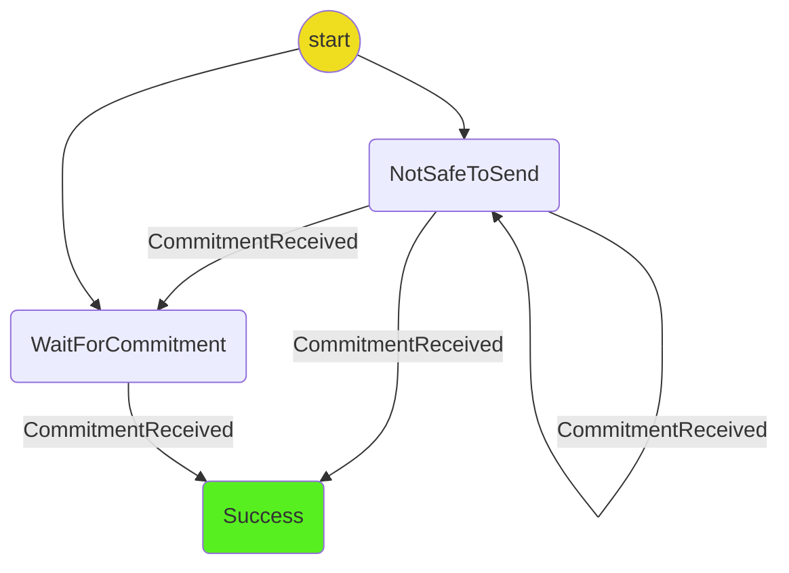

### Preparing a channel (WIP)

Here is a potential state machine diagram for preparing a channel.

```mermaid
graph TD
linkStyle default interpolate basis
  St((start)) --> NSTS(NotSafeToSend)
  NSTS --> |CommitmentReceived| WFC
  NSTS --> |CommitmentReceived| NSTS
  NSTS --> |CommitmentReceived| S
  St((start)) --> WFC(WaitForCommitment)
  WFC --> |CommitmentReceived| S(Success)

  classDef logic fill:#efdd20;
  classDef Success fill:#58ef21;
  classDef Failure fill:#f45941;
  classDef WaitForChildProtocol stroke:#333,stroke-width:4px,color:#ffff,fill:#333;
  class St logic;
  class S Success;
  class F Failure;
  class Fi WaitForChildProtocol
  class WFG WaitForChildProtocol
  class WFJ WaitForChildProtocol
  class WFGF WaitForChildProtocol
```
