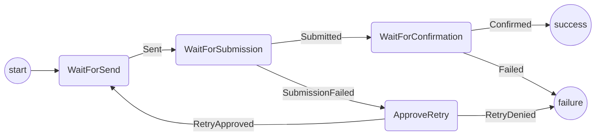

# Transaction Submission Protocol

The purpose of this protocol is to submit a transaction to the blockchain.
It covers:

- Sending the transaction to Metamask
- Waiting for confirmation
- Retrying in the case of a transaction failure

Out of scope (for the time being):

- Communicating progress to other participants (if required)
- Waiting for finalization (for the transaction to be n blocks deep)
- Handling chain reorgs
- Resubmitting transaction with higher gas if taking too long

## State machine

The protocol is implemented with the following state machine

Notes:

- Sending = sending to metamask (removing from the transaction outbox)
- Submitting = adding to the blockchain transaction pool
- Confirming = when the transaction is mined
- In the code, all the actions are prefixed with the word "Transaction" e.g. "TransactionSent" etc.
- We don't offer a retry in the `TransactionFailed` case, as this indicates that there was something wrong with the transaction, so we shouldn't retry it.

## Test scenarios

To test all paths through the state machine we will use 4 different scenarios:

1. Happy path: `WaitForSend` -> `WaitForSubmission` -> `WaitForConfirmation` -> `Success`
2. Retry and approve: `WaitForSubmission` -> `ApproveRetry` -> `WaitForSend2`
3. Retry and deny: `WaitForSubmission` -> `ApprovedRetry` -> `Failure`
4. Transaction failed: `WaitForConfirmation` -> `Failure2`
