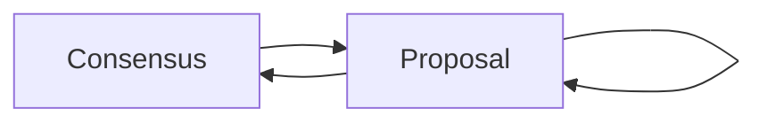

# Consensus App

Our current implementation of the consensus app in the wallet supports three transitions.

1. Propose (Consensus->Proposal)
2. Vote (Proposal->Proposal)
3. AcceptConsensus(Proposal-Consensus)

The first player (player A) is always the one to propose a new consensus.

