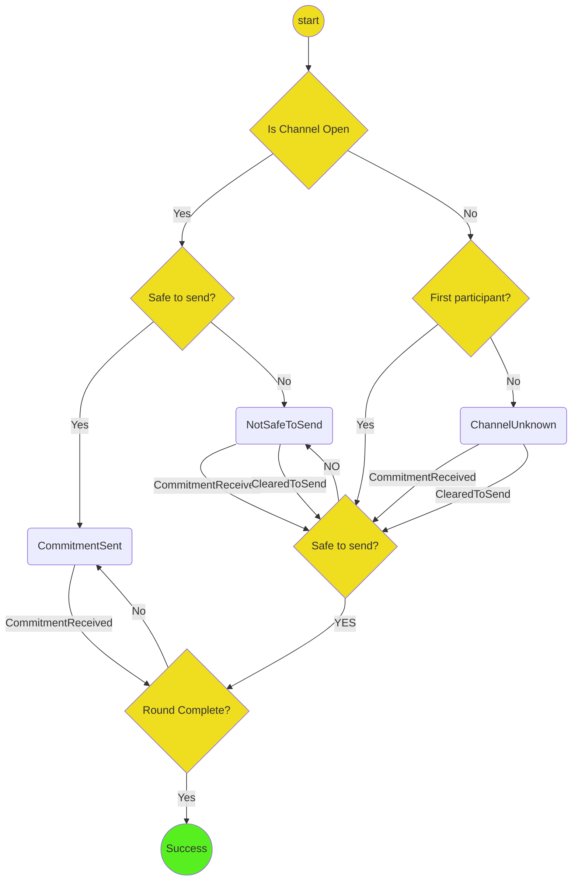

# Advancing the stage of a channel

The `AdvanceStage` protocol accepts two mandatory inputs and one optional input:

- `processId: String`
- `sharedData: Storage`
- `commitmentType: CommitmentType`
- `args?`: the data needed to initialize the state. When the channel doesn't exist, this is the data needed to initialize the channel. When the channel does exist, it is just the channel id.

It returns success when the latest commitment on the channel is at least the commitment type given.

It can be used in any stage where the application attributes cannot change -- in other words, any stage other than the application stage.

When the channel does not exist, it writes a new channel to storage. When the channel does exist, it updates its latest commitments in storage in the following two cases:

1. When it is safe to send the next commitment
2. When the next stage has been reached.

It is safe to send the next commitment when a valid round of commitments is received, and it is not a complete round of commitments of the given `commitmentType`

A round of commitments is valid if either of the following conditions hold

- The first commitment is the latest stored commitment, each transition is valid, and there are `participants.length` commitment.
- The first commitment has `turnNum == 0`, each transition is valid, and it is now the participant's turn.

When it is safe to send the next commitment, the protocol

1. Crafts the next commitment
2. Stores the latest round of commitments in storage
3. Sends the latest round of commitments to the next participant in the channel

When a round of commitments is received or sent, and each commitment is of the target stage, the protocol

1. Stores the latest round of commitments in storage.
2. Forwards the latest round of commitments to the next participant, unless they are the last participant.
3. Returns success.

If the parameters passed to `initialize` are invalid, then it moves directly to `Failure`.
This can happen if, for example, the channel doesn't exist, but the `startingOpts` is undefined.
It can also happen if the `commitmentType` is incompatible with the latest commitment in storage.

## Decisions

- To simplify the communication assumptions in a channel with an arbitrary number of participants, each participant sends a valid round of commitments only to the next participant.

## Open questions

- What should cause the protocol to fail?

## State machine diagram

