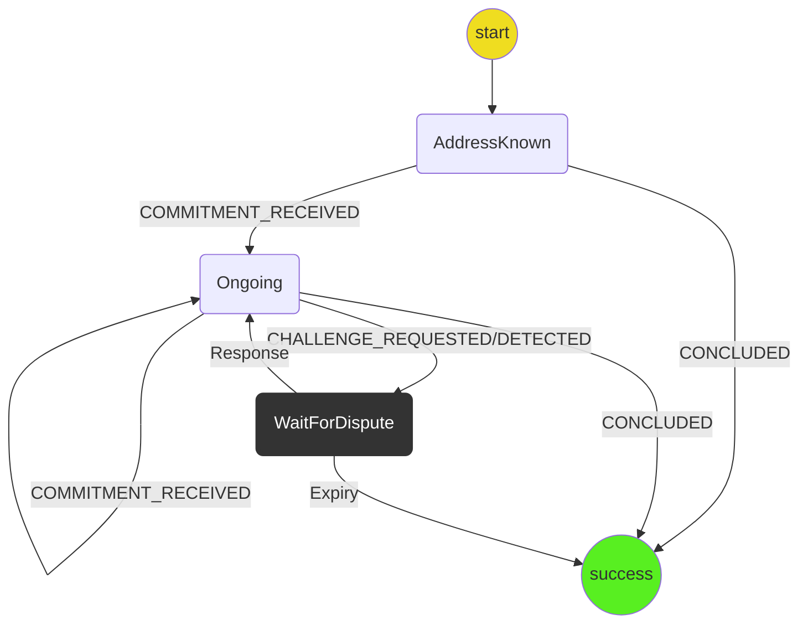

# Application Protocol

**[Home](../../../../notes/index.md)**

The purpose of this protocol is to manage the application's commitments.

It should be triggered by the `INITIALIZE_CHANNEL` event from the app.
This prepares an address to be used to sign application commitments.

It should never fail.

## State machine

The protocol is implemented with the following state machine.

Notes:

- All action typestrings have had the `WALLET.APPLICATION` prefix suppressed in the above diagram
- `COMMITMENT_RECEIVED` is shorthand for either `OWN_COMMITMENT_RECEIVED` or `OPPONENT_COMMITMENT_RECEIVED`
- `CONCLUDED` should get triggered when a conclude is requested _and then sent from the wallet_. This means that the application protocol no longer needs to listen for commitments from the app. In particular, if the conclude is requested and then cancelled, `CONCLUDED` will not be triggered.
- The application protocol is responsible for sending out signature and validation messages.

## Scenarios

1. **Initializing Application**
   - `.`--> `WaitForFirstCommitment`
2. **Starting Application**
   - `WaitForFirstCommitment` --> `Ongoing`
3. **Receiving a close request**
   - `Ongoing` --> `Success`
4. **Receiving our commitment**
   - `Ongoing` --> `Ongoing`
5. **Receiving their commitment**
   - `Ongoing` --> `Ongoing`
6. **Receiving their invalid commitment**
   - `Ongoing` --> `Ongoing`
7. **Receiving our invalid commitment**
   - `Ongoing` --> `Ongoing`
8. **Challenge was requested**
   - `Ongoing` --> `WaitForDispute`
9. **Challenge was detected**
   - `Ongoing` --> `WaitForDispute`
10. **Challenge responded to**
    - `WaitForDispute` --> `Ongoing`
11. **Challenge expired**
    - `WaitForDispute` --> `Success`
