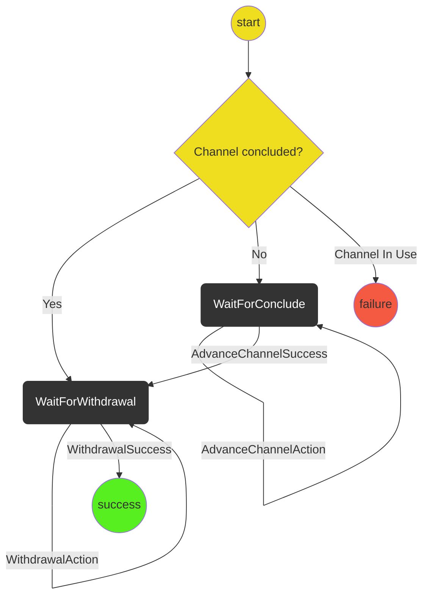

#Close Ledger Channel Protocol

The purpose of the protocol is conclude the given channel and withdraw funds from the channel.

There are two main responsibilities of the protocol:

- Given a ledger channel L exchange conclude commitments so the channel is finalized (using the AdvanceChannel protocol)
- Call ConcludeAndWithdraw on chain to register the finalization proof and withdraw the funds (using the withdraw protocol)

This protocol will typically be run when a user has decided they are done with a ledger channel.

We should handle the case where a channel has already been concluded (to handle the case of a crash).
We should also do a sanity check of making sure the channel is not being used to fund any other channels.

## Out of Scope

- Handling directly funded application channels (TODO: This just might work?)

## State machine diagram

