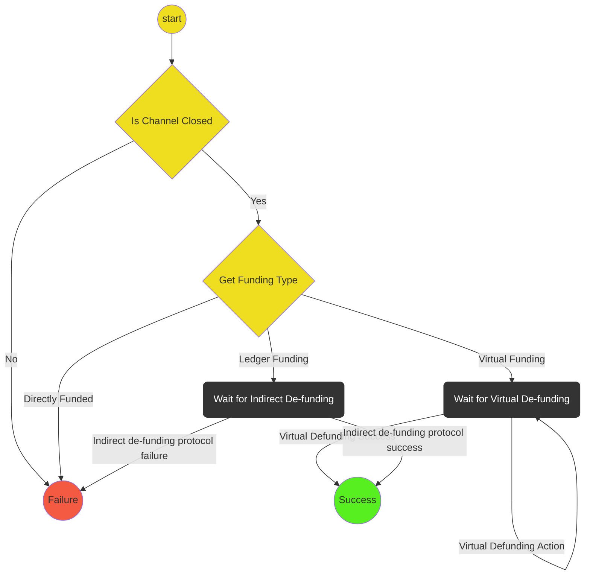

# De-Funding Protocol

This protocol handles de-funding a channel. It includes:

- Checking to see that a channel is finalized (either concluded or finalized on chain)
- If a direct channel, initiates the withdrawal protocol.
- Monitoring the blockchain for a response or timeout.

## State machine

The protocol is implemented with the following state machine

## Notes

- Withdrawal Complete/Failure and Indirect de-funding Complete/Failure are not actions. They are checks on the sub-protocol state to see if success/failure has been reached.
