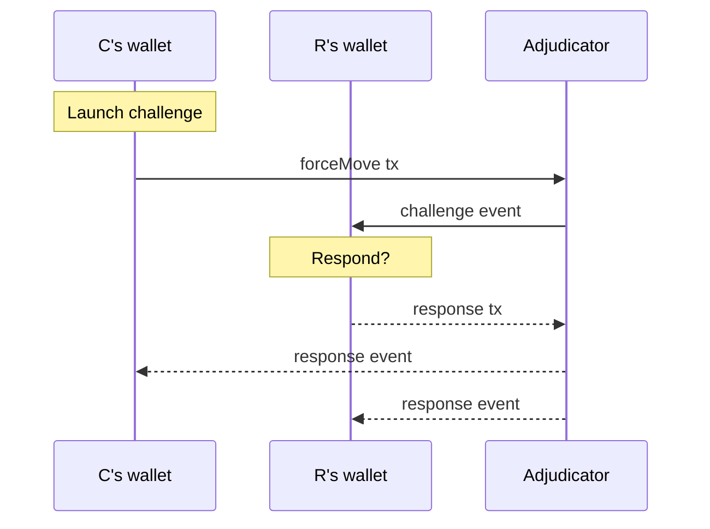

# Dispute

The dispute protocol coordinate the processes of challenging and responding to inactivity in a channel.

## The Protocol

The dispute protocol involves two parties: challenger and responder.
The challenger submits a forceMove transaction. The responder spots the blockchain event and either responds in time (and the channel continues) or fails to. In the latter case, the channel is closed and may be defunded.

We therefore split the overall dispute protocol into two sub state machines: [challenger](./challenger/readme.md) and [responder](./responder/readme.md).

The two state machines interact through the following messages:

