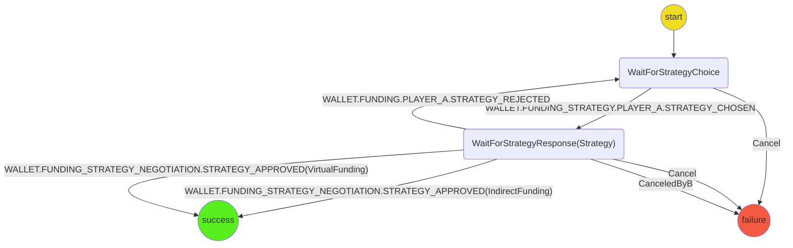
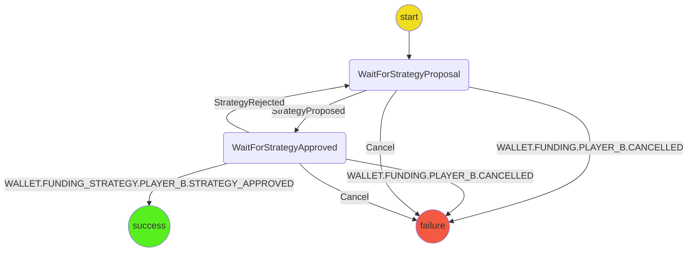

# Funding Strategy Negotiation Protocol

The strategy negotiation protocol is responsible for two players coordinating on a funding strategy.

## State machine

The protocol is implemented with the following state machines

### Player A

### Player B

