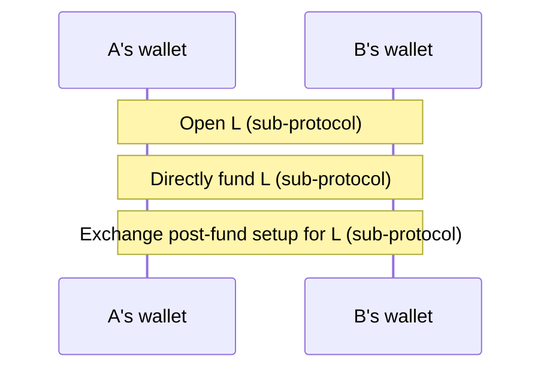
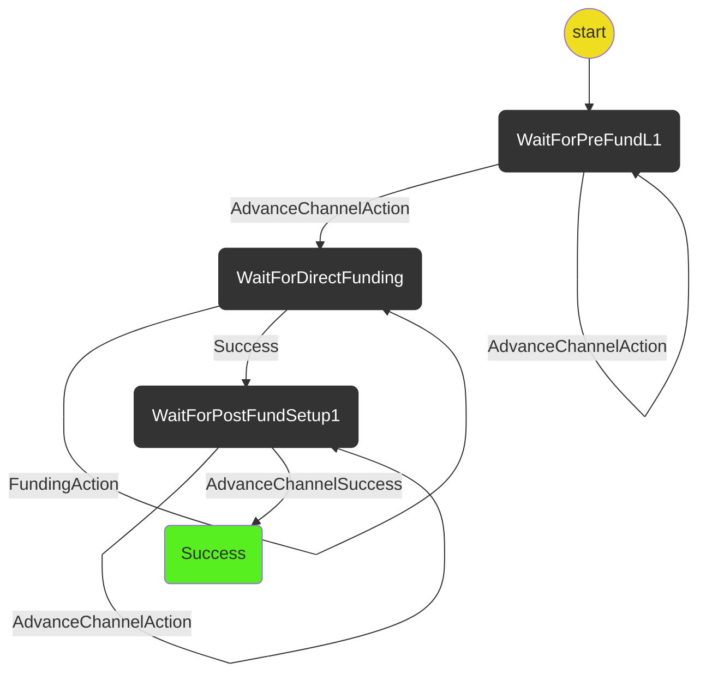

# New Ledger Channel

The new ledger channel protocol coordinates the process of opening + funding a new ledger channel.

Out of scope (for now):

- Handling the case where an opponent stalls mid-protocol

## The Protocol

The protocol interacts between client wallets through the following messages:

### State Machine

