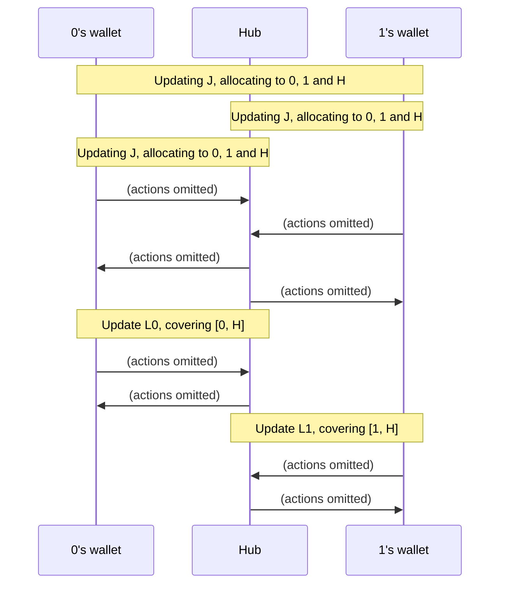
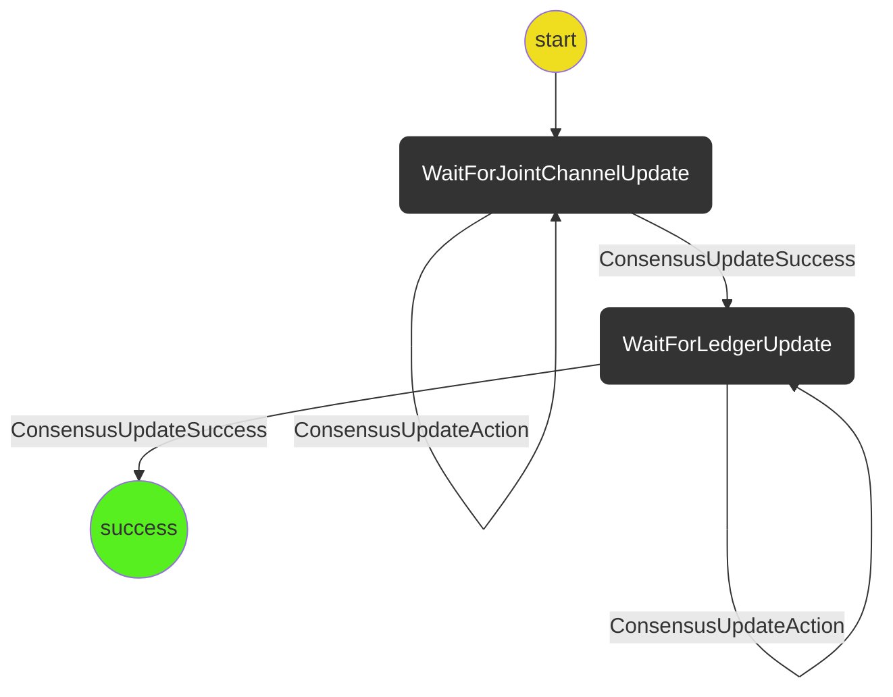

# Virtual De-Funding

The virtual de-funding protocol takes a virtual channel that is funding an application channel and de-funds it resulting updated ledger channels with the hub.

The virtual de-funding protocol starts with the following channels:

- The application channel X which is now concluded.
- The virtual channel J which funds X
- Guarantor channels G0 (between player 0 and the hub) and G1(between player 1 and the hub)
- Ledger channels L0(which funds G0) and L1(which funds G1)

The virtual de-funding protocol does the following

- Updates J to reflect the results of X
- Updates L0 to reflect the results of J
- Updates L1 to reflect the results of J

After the protocol is run bother player 0 and player 1 have updated ledger channels with the hub that reflect the result of X.

The virtual de-funding protocol leaves these ledger channels open so they can be re-used in the future or closed by another protocol.

The Guarantor channels G0 and G1 as well as the joint channel J do not need to be updated and can simply be discarded after virtual de-funding.

The virtual de-funding protocol involves three parties: player 0, player 1, and the hub H.
Player 0 is identified by being the participant at index 0 in the `participants` array in
the application channel X that is to be funded.

In the following overview diagram, some communication related to embedded protocols are omitted.

## Out of Scope

- Getting funds out of the ledger channels (this can be handled by other protocols).
- Removing discarded channels G0,G1,J from state.

## State machine diagram

